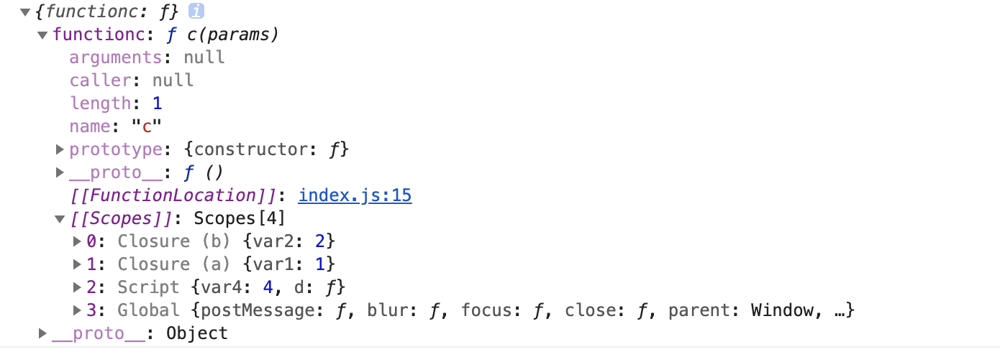
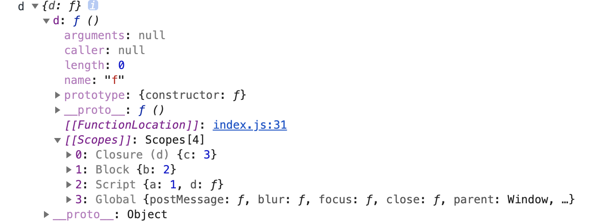

## 闭包

### 1. 定义

### 				闭包是指有权访问另一个函数作用域中的变量的函数。创建闭包的常见方式，就是在一个函数内部创建另一个函数。（通过原型链携带外部函数作用域的函数）。当函数返回了一个闭包时，这个函数的作用域将会一直在内存中保存到闭包不存在为止。

###2. 表现

​		**闭包封装了局部变量，使得函数具有状态。**

* 在另一个函数内部定义的函数会将包含外部函数的活动对象添加到它的作用域链中
* 外部函数返回内部函数，外部函数执行完毕，其执行环境的作用域链会被销毁，但它的活动对象仍然会留在内存中，因为内部函数的作用域链仍然在引用这个活动对象，直到内部函数被销毁
* 闭包会携带包含它的函数的作用域，因此会比其他函数占用更多的内存。过度使用闭包可能会导致内存占用过多

### 3. 实例

```javascript
function a (params) {
  const var1 = 1
  return function b(params) {
    let var2 = var1+1
    return function c(params) {
      let var3 = var2+1
      return var3
    }
  }
}
let var4 = 4
// 返回函数c
let d = a()()
console.log({functionc:d})
```



1. Function c 的作用域链

   Closure (b) =>Closure(a)=>Script=>Global

   function b 变量对象=> function a 变量对象=> Script 变量对象=>全局变量对象

2. 函数a ，b 运行后，得到函数c，并赋值给d。

   调用栈中，a,b执行上下文已经退栈，其自身的作用域链已经销毁。但a,b的变量对象（Closure (b)，Closure(a)）还保存在内存中，因为它们还被function c 的作用域链引用。

### 4. 作用域链中作用域类型（变量对象类型）

1. Closure

   由函数嵌套产生

2. Local

   由函数内部产生

3. Block

   由块级作用域(打括号)产生

4. Script

   由全局局部变量（const let）产生

5. Global

   全局对象（window,包括var声明的变量）

```javascript
let a = 1;
let d = null
{
  let b = a+1;
    d =function (){
      let c = b+1
      let f = function(){
        return c
      }
      return f;
    }
}
console.log('d', {d:d()})
```



### 5. 私有变量

​		有权访问私有变量的公有方法叫做特权方法。

1. 构造函数实现实例私有变量

   ```javascript
   function People(){
     let name = 'tbl'
     let say = function (params) {
       console.log('params', params)
     }
     this.fun = function(){
       say()
     }
   }
   ```

2. 原型链实现静态私有变量

   ```javascript
   function People(params) {
   }
   (function () {
     let name = 'tbl'
     People.prototype.say = function(){
       console.log('name', name)
     }
   })()
   ```

   ​		这个模式与在构造函数中定义特权方法的主要区别，就在于私有变量和函数是由实例共享的。由于特权方法是在原型上定义的，因此所有实例都使用同一个函数。而这个特权方法，作为一个闭包，总是保存着对包含作用域的引用。

   ​		可以使用构造函数模式、原型模式来实现自定义类型的特权方法，也可以使用模块模式、增强的模块模式来实现单例的特权方法。