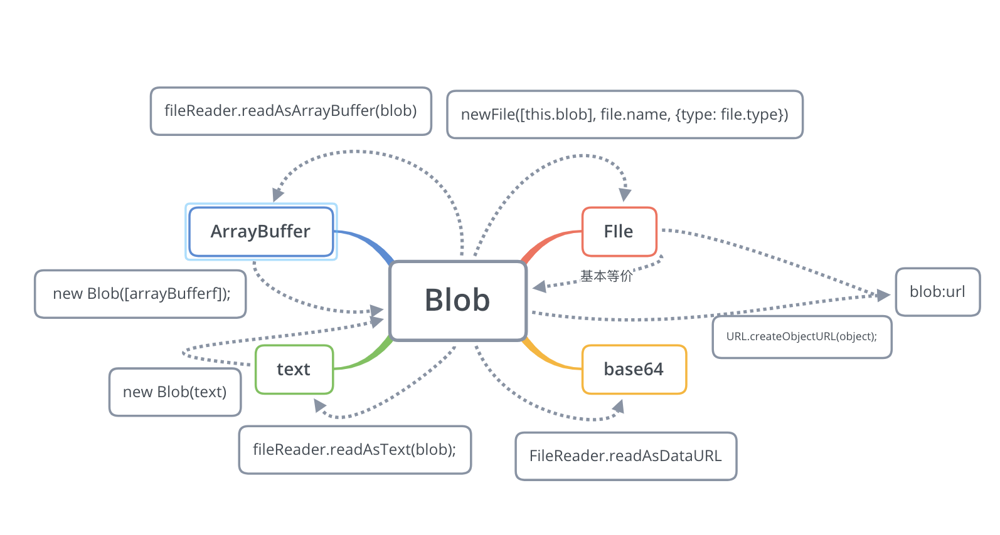

### File

####1. `File` 对象是特殊类型的 [`Blob`](https://developer.mozilla.org/zh-CN/docs/Web/API/Blob)

#### 2. FIleReader

```javascript
FileReader.abort()
//中止读取操作。在返回时，readyState属性为DONE。
FileReader.readAsArrayBuffer()
//开始读取指定的 Blob中的内容, 一旦完成, result 属性中保存的将是被读取文件的 ArrayBuffer 数据对象.
FileReader.readAsBinaryString() 
//开始读取指定的Blob中的内容。一旦完成，result属性中将包含所读取文件的原始二进制数据。
FileReader.readAsDataURL()
//开始读取指定的Blob中的内容。一旦完成，result属性中将包含一个data: URL格式的字符串以表示所读取文件的内容。
//FileReader.readAsText()
开始读取指定的Blob中的内容。一旦完成，result属性中将包含一个字符串以表示所读取的文件内容。
```




