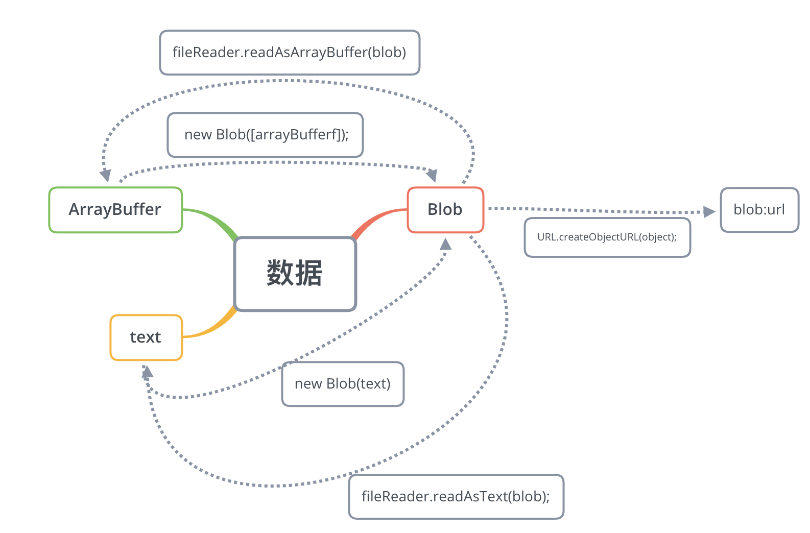

### 视频处理方案

### 1. 应用场景

* 普通播放

  ```html
  <video autoplay controls src="https://pingan.develop.smartcity.site:10443/nantong/video/huangpu.mp4"></video>
  
  ```

* 防盗链播放

  ​		目前的云存储服务商大部分都支持referer防盗链。其原理就是在访问资源时，请求头会带上发起请求的页面地址，判断其不存在（表示直接访问图片地址）或不在白名单内，即为盗链。

  ```javascript
  Accept-Encoding: identity;q=1, *;q=0
  Range: bytes=2424832-
  Referer: http://127.0.0.1:5500/video/index.html
  Sec-Fetch-Mode: no-cors
  User-Agent: Mozilla/5.0 (Macintosh; Intel Mac OS X 10_14_5) AppleWebKit/537.36 (KHTML, like Gecko) Chrome/76.0.3809.100 Safari/537.36
  ```

  

* 流媒体播放

  ```html
  <video preload="auto" src="blob:https://www.bilibili.com/3368bab9-696b-4260-b823-fef6cfff661f"></video>
  ```

  

### 2. 主要技术

* Blob和ArrayBuffer

  * Blob对象表示一个只读原始数据的类文件对象，虽然是二进制原始数据但是类似文件的对象，因此可以像操作文件对象一样操作Blob对象。

  * ArrayBuffer对象用来表示通用的、固定长度的原始二进制数据缓冲区。我们可以通过new ArrayBuffer(length)来获得一片连续的内存空间，它不能直接读写，但可根据需要将其传递到TypedArray视图或 DataView 对象来解释原始缓冲区。实际上视图只是给你提供了一个某种类型的读写接口，让你可以操作ArrayBuffer里的数据。TypedArray需指定一个数组类型来保证数组成员都是同一个数据类型，而DataView数组成员可以是不同的数据类型。

  * Blob与ArrayBuffer的区别是，除了原始字节以外它还提供了mime type作为元数据，Blob和ArrayBuffer之间可以进行转换。

  * File对象其实继承自Blob对象，并提供了提供了name ， lastModifiedDate， size ，type 等基础元数据。

  * 创建Blob对象并转换成ArrayBuffer：

    ```javascript
    const text = "<div>hello world</div>";
    const blob = new Blob([text], { type: "text/html" }); // Blob {size: 22, type: "text/html"}
    //以文本读取
    const textReader = new FileReader();
    textReader.readAsText(blob);
    textReader.onload = function() {
      console.log(textReader.result); // <div>hello world</div>
    };
    //以ArrayBuffer形式读取
    const bufReader = new FileReader();
    bufReader.readAsArrayBuffer(blob);
    bufReader.onload = function() {
      console.log(new Uint8Array(bufReader.result)); // Uint8Array(22) [60, 100, 105, 118, 62, 104, 101, 108, 108, 111, 32, 119, 111, 114, 108, 100, 60, 47, 100, 105, 118, 62]
    };
    ```

  * 创建一个相同数据的ArrayBuffer，并转换成Blob：

    ```javascript
    //我们直接创建一个Uint8Array并填入上面的数据
    const u8Buf = new Uint8Array([60, 100, 105, 118, 62, 104, 101, 108, 108, 111, 32, 119, 111, 114, 108, 100, 60, 47, 100, 105, 118, 62]);
    const u8Blob = new Blob([u8Buf], { type: "text/html" }); // Blob {size: 22, type: "text/html"}
    const textReader = new FileReader();
    
    textReader.readAsText(u8Blob);
    textReader.onload = function() {
      console.log(textReader.result); // 同样得到div>hello world</div>
    };
    
    ```

* URL.createObjectURL

  ```javascript
  const objectURL = URL.createObjectURL(object); //blob:http://localhost:1234/abcedfgh-1234-1234-1234-abcdefghijkl
  ```

  ​		这里的object参数是用于创建URL的File对象、Blob 对象或者 MediaSource 对象，生成的链接就是以blob:开头的一段地址，表示指向的是一个二进制数据。

  ​		其中localhost:1234是当前网页的主机名称和端口号，也就是location.host，而且这个Blob URL是可以直接访问的。需要注意的是，即使是同样的二进制数据，每调用一次URL.createObjectURL方法，就会得到一个不一样的Blob URL。这个URL的存在时间，等同于网页的存在时间，一旦网页刷新或卸载，这个Blob URL就失效。

  ​		通过URL.revokeObjectURL(objectURL) 释放一个之前已经存在的、通过调用 URL.createObjectURL() 创建的 URL 对象。当你结束使用某个 URL 对象之后，应该通过调用这个方法来让浏览器知道不用在内存中继续保留对这个文件的引用了,允许平台在合适的时机进行垃圾收集。



* 流媒体格式

  * HLS （HTTP Live Streaming）, 

    ​		是由 Apple 公司实现的基于 HTTP 的媒体流传输协议。HLS以ts为传输格式，m3u8为索引文件（文件中包含了所要用到的ts文件名称，时长等信息，可以用播放器播放，也可以用vscode之类的编辑器打开查看），在移动端大部分浏览器都支持，也就是说你可以用video标签直接加载一个m3u8文件播放视频或者直播，但是在pc端，除了苹果的Safari，需要引入库来支持。用到此方案的视频网站比如优酷，可以在视频播放时通过调试查看Network里的xhr请求，会发现一个m3u8文件，和每隔一段时间请求几个ts文件。

    * m3u8文件 safria的地址栏和video标签可以直接解析该文件并播放视频
    * 每个视频片段为ts文件

    ```html
    #EXTM3U
    #EXT-X-VERSION:3
    #EXT-X-MEDIA-SEQUENCE:0
    #EXT-X-ALLOW-CACHE:YES
    #EXT-X-TARGETDURATION:11
    #EXTINF:5.000000,
    https://valipl-vip.cp31.ott.cibntv.net/67756D6080932713CFC02204E/ad/XNDI3OTIzMzYwOA==/03000700005D315C18D7A490000000BED98D28-4C7D-45FB-B7D0-545E5B1C9ADC-00001.ts?ccode=0502&duration=2676&expire=18000&psid=7b5c9345388187925cc6c8a28ff39d34&ups_client_netip=716eac49&ups_ts=1565680799&ups_userid=88743782&utid=TZuSFU3KIlMCAXF0dnGn3TT4&vid=XNDI0NDYyNjk1Mg&sm=1&operate_type=1&bc=2&vkey=A7df34d1fa6d55767f5202ee33288c806
    #EXT-X-DISCONTINUITY
    #EXTINF:10.000000,
    https://valipl-vip.cp31.ott.cibntv.net/67756D6080932713CFC02204E/03000600005D30C4540A61B5C99AF7CCD37380-5710-42CD-A2D4-FA757543C189-00001.ts?ccode=0502&duration=2676&expire=18000&psid=7b5c9345388187925cc6c8a28ff39d34&ups_client_netip=716eac49&ups_ts=1565680799&ups_userid=88743782&utid=TZuSFU3KIlMCAXF0dnGn3TT4&vid=XNDI0NDYyNjk1Mg&sm=1&operate_type=1&bc=2&vkey=A12bcf0b3823ce5fdc0ae3f4dfed44612
    
    ```

  * DASH（Dynamic Adaptive Streaming over HTTP） ，

    ​		是一种在互联网上传送动态码率的Video Streaming技术，类似于苹果的HLS，DASH会通过media presentation description (MPD)将视频内容切片成一个很短的文件片段，每个切片都有多个不同的码率，DASH Client可以根据网络的情况选择一个码率进行播放，支持在不同码率之间无缝切换。

    Youtube，B站都是用的这个方案。这个方案索引文件通常是mpd文件（类似HLS的m3u8文件功能），传输格式推荐的是fmp4（Fragmented MP4）,文件扩展名通常为.m4s或直接用.mp4。所以用调试查看b站视频播放时的网络请求，会发现每隔一段时间有几个m4s文件请求。

  * MediaSource

    ​		用来实现视频片段拼接功能，MediaSource接口功能也很纯粹，作为一个媒体数据容器可以和HTMLMediaElement进行绑定。基本流程就是通过URL.createObjectURL创建容器的BLob URL，设置到video标签的src上，在播放过程中，我们仍然可以通过MediaSource.appendBuffer方法往容器里添加数据，达到更新视频内容的目的。

    ```javascript
    const video = document.querySelector('video');
    //视频资源存放路径，假设下面有5个分段视频 video1.mp4 ~ video5.mp4，第一个段为初始化视频init.mp4
    const assetURL = "http://www.demo.com";
    //视频格式和编码信息，主要为判断浏览器是否支持视频格式，但如果信息和视频不符可能会报错
    const mimeCodec = 'video/mp4; codecs="avc1.42E01E, mp4a.40.2"'; 
    if ('MediaSource' in window && MediaSource.isTypeSupported(mimeCodec)) {
      const mediaSource = new MediaSource();
      video.src = URL.createObjectURL(mediaSource); //将video与MediaSource绑定，此处生成一个Blob URL
      mediaSource.addEventListener('sourceopen', sourceOpen); //可以理解为容器打开
    } else {
      //浏览器不支持该视频格式
      console.error('Unsupported MIME type or codec: ', mimeCodec);
    }
    
    function sourceOpen () {
      const mediaSource = this;
      const sourceBuffer = mediaSource.addSourceBuffer(mimeCodec);
      let i = 1;
      function getNextVideo(url) {
        //ajax代码实现翻看上文，数据请求类型为arraybuffer
        ajax(url, function(buf) {
          //往容器中添加请求到的数据，不会影响当下的视频播放。
          sourceBuffer.appendBuffer(buf);
        });
      }
      //每次appendBuffer数据更新完之后就会触发
      sourceBuffer.addEventListener("updateend", function() {
        if (i === 1) {
          //第一个初始化视频加载完就开始播放
          video.play();
        }
        if (i < 6) {
          //一段视频加载完成后，请求下一段视频
          getNextVideo(`${assetURL}/video${i}.mp4`);
        }
        if (i === 6) {
          //全部视频片段加载完关闭容器
          mediaSource.endOfStream();
          URL.revokeObjectURL(video.src); //Blob URL已经使用并加载，不需要再次使用的话可以释放掉。
        }
        i++;
      });
      //加载初始视频
      getNextVideo(`${assetURL}/init.mp4`);
    };
    
    ```

  * Fragmented MP4

    ​		通常我们使用的mp4文件是嵌套结构的，客户端必须要从头加载一个 MP4 文件，才能够完整播放，不能从中间一段开始播放。而Fragmented MP4（简称fmp4），就如它的名字碎片mp4，是由一系列的片段组成，如果服务器支持 byte-range 请求，那么，这些片段可以独立的进行请求到客户端进行播放，而不需要加载整个文件。我们通过[FFmpeg](https://link.juejin.im/?target=https%3A%2F%2Fffmpeg.org%2F)或[Bento4](https://link.juejin.im/?target=https%3A%2F%2Fwww.bento4.com%2F)的mp4fragment来将普通mp4转换为Fragmented MP4

    ```shell
    ffmpeg -i video.mp4 -movflags empty_moov+default_base_moof+frag_keyframe video-fragmented.mp4
    ```

    