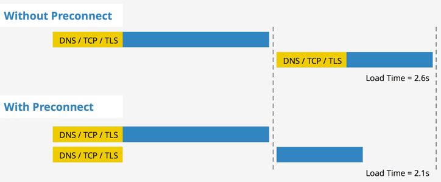

1. 基本规则

   - 默认情况下，CSS 被视为阻塞渲染的资源。
   - 我们可以通过媒体类型和媒体查询将一些 CSS 资源标记为不阻塞渲染。
   - 浏览器会下载所有 CSS 资源，无论阻塞还是不阻塞。

   **CSS 是阻塞渲染的资源。需要将它尽早、尽快地下载到客户端，以便缩短首次渲染的时间。**

   ```javascript
   <link href="style.css" rel="stylesheet">
   <link href="print.css" rel="stylesheet" media="print">
   <link href="other.css" rel="stylesheet" media="(min-width: 40em)">
   ```

   ​	“阻塞渲染”仅是指浏览器是否需要暂停网页的首次渲染，直至该资源准备就绪。无论哪一种情况，浏览器仍会下载 CSS 资产，只不过不阻塞渲染的资源优先级较低罢了。

2. CSS影响

   * CSS下载，CSSOM构建不会阻塞 DOM 的解析
   * CSS下载，CSSOM构建阻塞页面渲染(渲染树构建)
   * Style media="none" 防止CSS下载，CSSOM构建阻塞页面渲染(渲染树构建)

3. JS影响

   - JS执行阻塞DOM和页面渲染(渲染树构建)

   - JS同步下载阻塞DOM和页面渲染(渲染树构建)

     

     

     

   - JS异步下载不阻塞DOM和页面渲染(渲染树构建)

     - defer

     

     

     - async

     

   - JS 在CSS之前 ：JS执行阻塞CSSOM

   - JS 在CSS之后 ：延迟脚本执行和 DOM 构建，直至其完成 CSSOM 的下载和构建

     

4. [Link preload](https://developer.mozilla.org/zh-CN/docs/Web/HTML/Preloading_content)

   只异步加载，不执行  需要指定执行。可以不影响onload事件, 不阻塞页面的初步渲染。缓存到内存

   - style

     ```html
       <link rel="preload" href="./index.css" as="style" onload="this.rel='stylesheet'">
     ```

   - js 预加载，命中缓存，执行

     ```html
     <link rel="preload" href="./app.js" as="script">
     ```

     ```javascript
     window.onload = function() {
       const script = document.createElement("script");
     	script.src = "./app.js";
     	document.body.appendChild(script);
     }
     ```

   

5. Link prefetch

   - style，resource，js，下一页面

     HTTP缓存

     ```
     <link rel="prefetch" href="/uploads/images/pic.png">
     <link rel="dns-prefetch" href="//fonts.googleapis.com">
     <link rel="prerender" href="https://www.keycdn.com">
     ```

   

6. link  Preconnect

   preconnect 允许浏览器在一个 HTTP 请求正式发给服务器前预先执行一些操作，这包括 DNS 解析，TLS 协商，TCP 握手，这消除了往返延迟并为用户节省了时间。

   ```html
   <link href="https://cdn.domain.com" rel="preconnect" crossorigin>
   ```

   

7. Prefetch vs Preload

   * 网络请求的优先级

     在Chrome中，Prefetch的优先级为Lowest。而Preload的优先级则是根据as属性值所对应的资源类型来决定，总体上，Preload的优先级比Prefetch高。不过两者都不应该延迟页面的load事件。

   * 缓存策略

     Preload加载的资源至少会被缓存到内存中，下一次请求的时候直接从缓存读取，从而减少从服务器加载的时间。

     Prefetch的缓存并未在标准中定义，所以浏览器不保证缓存资源。不过会根据资源本身的http缓存头进行相应的处理。

   * 重复加载

     如果Preload的资源还在途中，此时对相同的资源再发起请求，浏览器不会重复请求资源，而是等返回了再进行处理。

     而如果Prefetch的资源还在途中，再发请求，会导致二次请求（如上面“缓存策略”所示）。除此之外，有人可能会将Prefetch作为Preload的降级方案紧跟在Preload后面，也会产生两次请求

   * 页面跳转时的行为

     如果在当前页面跳转到下一页，在途的Preload请求会被取消。而Prefetch的请求会在导航过程中保持。

   * 适用场景

     Preload的设计初衷是为了让当前页面的关键资源尽早被发现和加载，从而提升首屏渲染性能。

     Prefetch是为了提前加载下一个导航所需的资源，提升下一次导航的首屏渲染性能。但也可以用来在当前页面提前加载运行过程中所需的资源，加速响应。

   

   

   

   