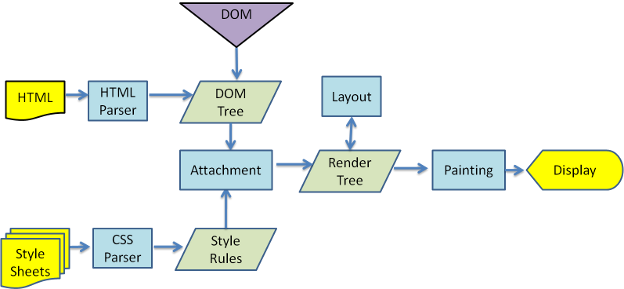
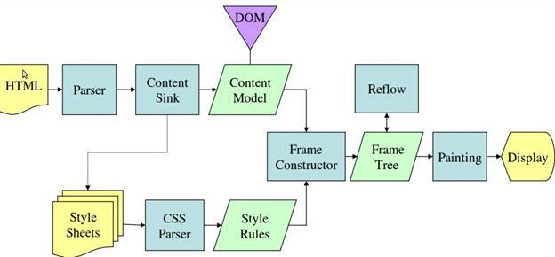

   

## 1.渲染引擎与js引擎

​	

| 浏览器  | 渲染引擎      | js引擎                                  | 年份 |
| ------- | ------------- | --------------------------------------- | ---- |
| IE      | Trident       | JScript，Chakra(ie9+)                   | 1995 |
| Edge    | EDGE          | Chakra                                  | 2015 |
| Firefox | Gecko         | SpiderMonkey->TraceMonkey->JaegerMonkey | 2004 |
| Safari  | WebKit        | JavascriptCore                          | 2003 |
| Chrome  | WebKit->Blink | V8                                      | 2008 |
| Opera   | Presto->Blink | Carakan                                 | 1995 |

* webkit

  

* geoko

  

## 2.性能测试

| 浏览器  | http://html5test.com | [http://www.speed-battle.com](http://www.speed-battle.com/) | http://acid3.acidtests.org/ | http://chromium.github.io/octane/ |
| ------- | -------------------- | ----------------------------------------------------------- | --------------------------- | --------------------------------- |
| Safari  | 458                  | 1674                                                        | 98                          | 49344                             |
| Opera   | 509                  | 1322                                                        | 97                          | 44462                             |
| Chrome  | 478                  | 1275                                                        | 97                          | 45126                             |
| Firefox | 488                  | 1886                                                        | 97                          | 36743                             |
| EDGE    | 481                  | 1293                                                        | 97                          | 45378                             |

