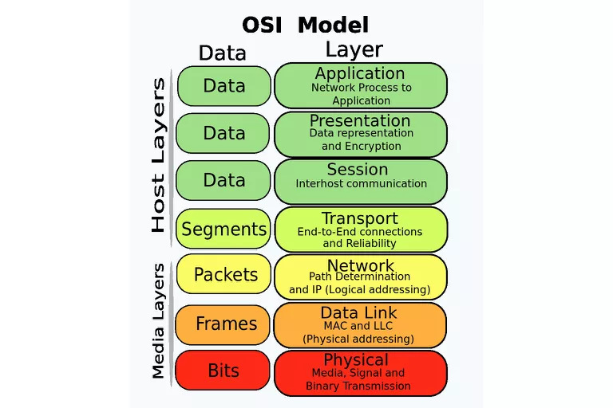
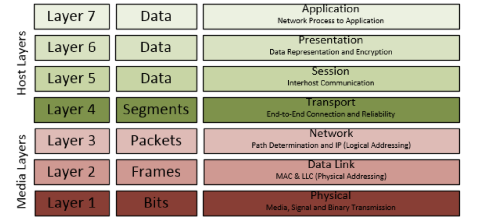

##OSI 参考模型

###参考模型结构

#### 1. 物理层

利用传输介质为数据链路层提供物理连接，**实现比特流的透明传输**。

* 网卡（有线无线，信号接收）
* 调制解调器（数字模拟，信号转换）
* 传输介质（电缆，光纤，无线信道，信号传输）
* 中继器（Wi-Fi热点，集线器，信号中转）

#### 2. 数据链路层

在两个网络实体之间提供数据链路连接的创建、维持和释放管理。设计数据链路层的主要目的就是在原始的、有差错的物理传输线路的基础上，采取差错检测、差错控制与流量控制等方法，将有差错的物理线路改进成逻辑上无差错的数据链路，向网络层提供高质量的服务。

* 数据封装：对物理层的原始数据进行数据封装，构成数据链路数据单元（frame：数据帧)
* 流量控制
* 差错控制

相关设备

* 交换机: 根据MAC地址转发数据包
* 网桥：负责网络桥接（network bridging）之用。桥接器将网络的多个网段在数据链路层连接起来（即桥接）。

#### 3. 网络层

提供路由和寻址的功能，使两终端系统能够互连且决定最佳路径，并具有一定的拥塞控制和流量控制的能力。相关协议：**IP协议**

* 寻址：对网络层而言使用IP地址来唯一标识互联网上的设备，网络层依靠IP地址进行相互通信（类似于数据链路层的MAC地址）
* 路由：在同一个网络中的内部通信并不需要网络层设备，仅仅靠数据链路层就可以完成相互通信，对于不同的网络之间相互通信则必须借助路由器等三层设备。

相关设备

* 路由器

#### 4. 传输层

OSI下3层的主要任务是数据通信，上3层的任务是数据处理。而传输层（Transport Layer）是OSI模型的第4层。因此该层是通信子网和资源子网的接口和桥梁，起到承上启下的作用。

向用户提供可靠的端到端的差错和流量控制，保证报文的正确传输。传输层的作用是向高层屏蔽下层数据通信的细节，即向用户透明地传送报文。该层常见的协议：**TCP协议、UDP协议、SSL/TLS协议 **。

* 传输连接管理：提供建立、维护和拆除传输连接的功能。传输层在网络层的基础上为高层提供“面向连接”和“面向无接连”的两种服务。
* 处理传输差错：提供可靠的“面向连接”和不太可靠的“面向无连接”的数据传输服务、差错控制和流量控制。在提供“面向连接”服务时，通过这一层传输的数据将由目标设备确认，如果在指定的时间内未收到确认信息，数据将被重发。
* 监控服务质量。

#### 5. 会话层（废弃，与应用层重叠）

用户应用程序和网络之间的接口，主要任务是：向两个实体的表示层提供建立和使用连接的方法。将不同实体之间的表示层的连接称为会话。因此会话层的任务就是组织和协调两个会话进程之间的通信，并对数据交换进行管理。
用户可以按照半双工、单工和全双工的方式建立会话。当建立会话时，用户必须提供他们想要连接的远程地址。而这些地址与MAC（介质访问控制子层）地址或网络层的逻辑地址不同，它们是为用户专门设计的，更便于用户记忆。域名（DN）就是一种网络上使用的远程地址。会话层的具体功能如下：

* 会话管理：允许用户在两个实体设备之间建立、维持和终止会话，并支持它们之间的数据交换。例如提供单方向会话或双向同时会话，并管理会话中的发送顺序，以及会话所占用时间的长短。
* 会话流量控制：提供会话流量控制和交叉会话功能。
* 寻址：使用远程地址建立会话连接。l
* 出错控制：从逻辑上讲会话层主要负责数据交换的建立、保持和终止，但实际的工作却是接收来自传输层的数据，并负责纠正错误。会话控制和远程过程调用均属于这一层的功能。

#### 6. 表示层（废弃，与应用层重叠）

表示层（Presentation Layer）是OSI模型的第六层，它对来自应用层的命令和数据进行解释，对各种语法赋予相应的含义，并按照一定的格式传送给会话层。其主要功能是“处理用户信息的表示问题，如编码、数据格式转换和加密解密”等。表示层的具体功能如下：

* 数据格式处理：协商和建立数据交换的格式，解决各应用程序之间在数据格式表示上的差异。
* 数据的编码：处理字符集和数字的转换。例如由于用户程序中的数据类型（整型或实型、有符号或无符号等）、用户标识等都可以有不同的表示方式，因此，在设备之间需要具有在不同字符集或格式之间转换的功能。
* 压缩和解压缩：为了减少数据的传输量，这一层还负责数据的压缩与恢复。

#### 7. 应用层

应用层（Application Layer）是OSI参考模型的最高层，它是计算机用户，以及各种应用程序和网络之间的接口，其功能是直接向用户提供服务，完成用户希望在网络上完成的各种工作。它在其他6层工作的基础上，负责完成网络中应用程序与网络操作系统之间的联系，建立与结束使用者之间的联系，并完成网络用户提出的各种网络服务及应用所需的监督、管理和服务等各种协议。此外，该层还负责协调各个应用程序间的工作。
应用层为用户提供的服务和协议有：

* **文件传输服务（FTP）**
* **DNS**
* **HTTP**
* **WebSocket**
* **远程登录服务（Telnet  SSH）**
* **电子邮件服务（IMAP4  POP3  SMTP）**

上述的各种网络服务由该层的不同应用协议和程序完成，不同的网络操作系统之间在功能、界面、实现技术、对硬件的支持、安全可靠性以及具有的各种应用程序接口等各个方面的差异是很大的。应用层的主要功能如下：

* 用户接口：应用层是用户与网络，以及应用程序与网络间的直接接口，使得用户能够与网络进行交互式联系
* 实现各种服务：该层具有的各种应用程序可以完成和实现用户请求的各种服务。

###参考模型现状

​		七层参考模型希望将“会话层”、“表示层”从广泛意义上的应用层里独立出来，这样可以让应用程序瘦身，核心目标是：让千千万万不同应用程序共享“会话层”、“表示层”软件代码。很遗憾的是，迄今为止这个美好的愿望依然没有实现，究其根本原因是，不同的应用程序有大同小异的会话、表示需求，这些代码不完全能够抽象到独立的会话层、表示层，或者说，现有的应用层已经比较完美实现了会话层、表示层，对于七层模型需求没有动力。所以会话层，表示层目前名存实亡。

