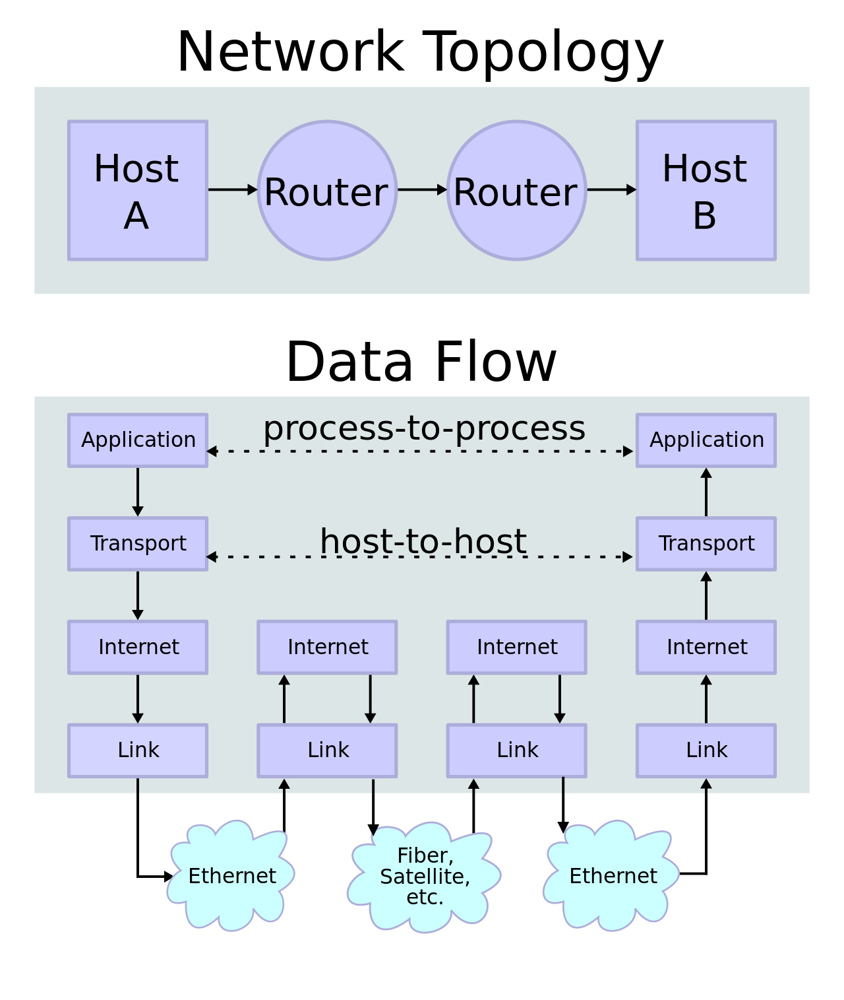
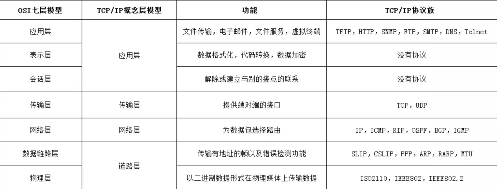
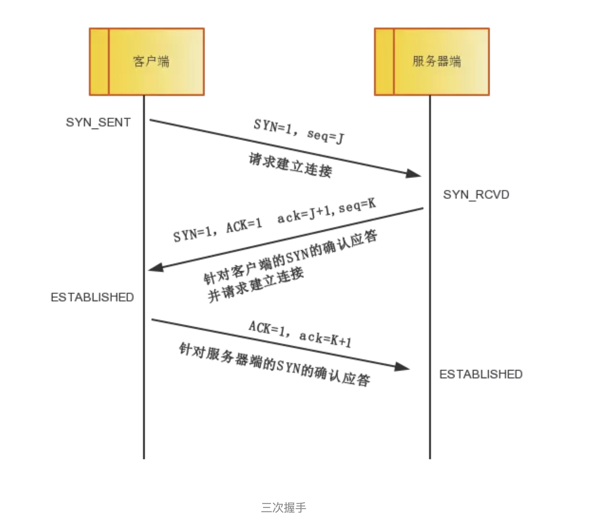
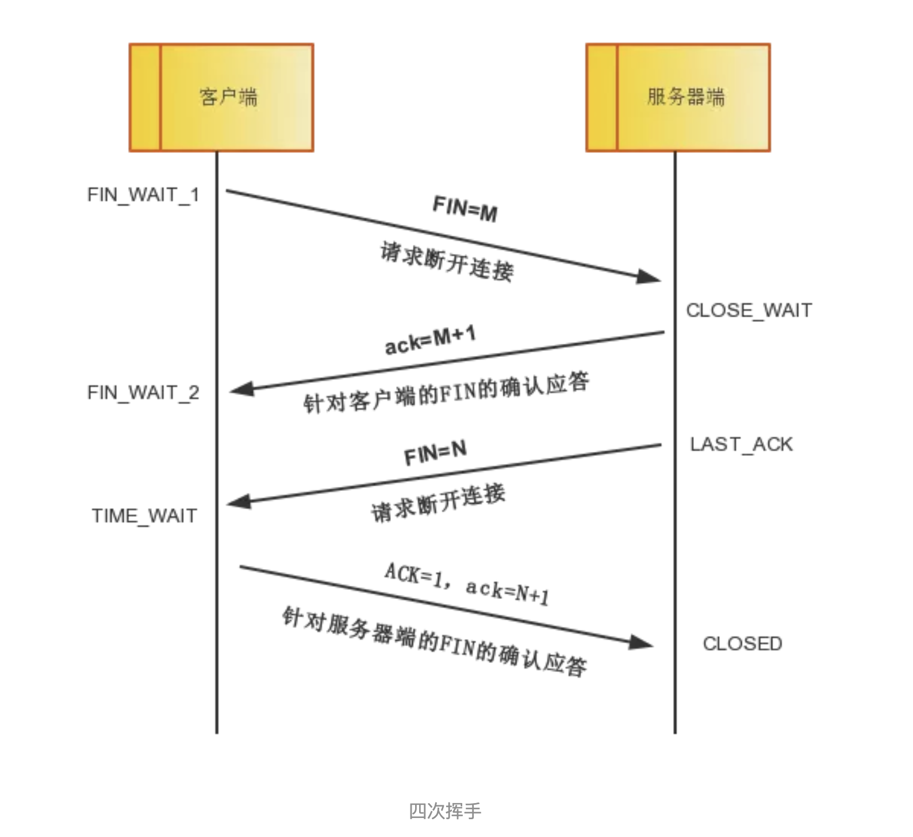
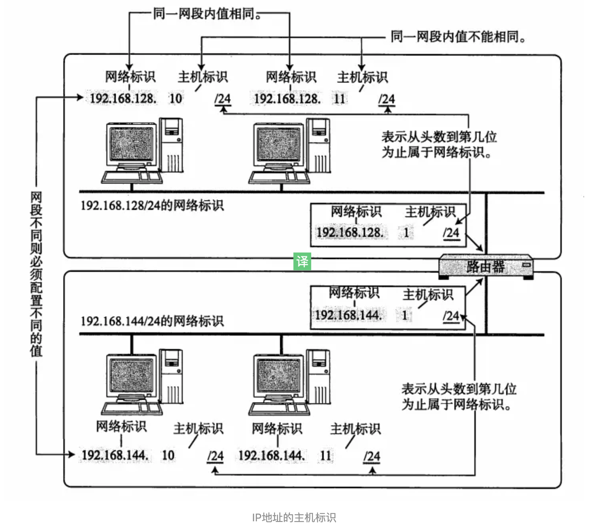
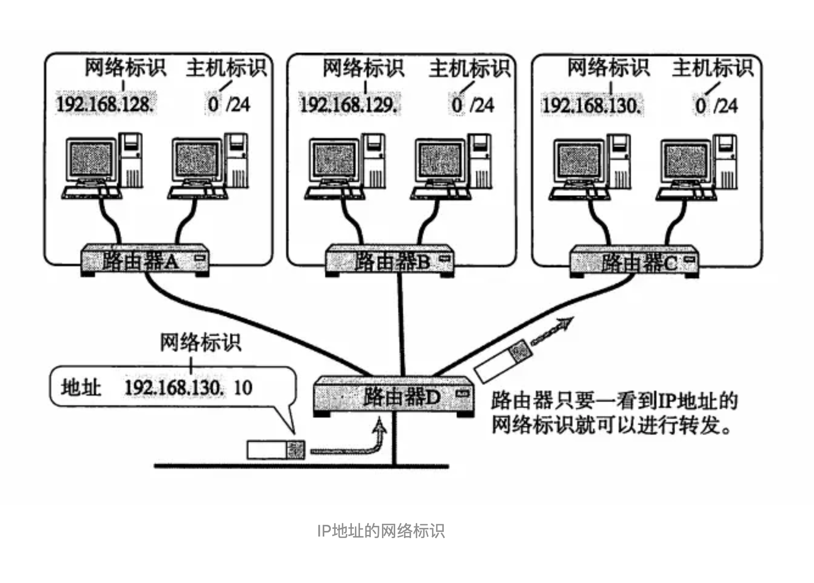
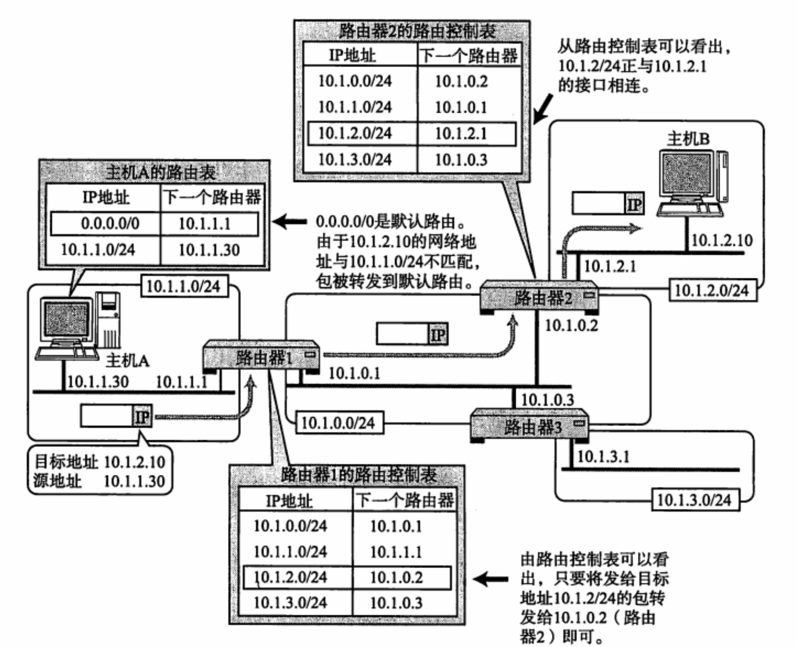

## [TCP/IP协议族](https://juejin.im/post/5a069b6d51882509e5432656#heading-29)

### 1. 概念

**TCP/IP协议族**，官方名称**互联网协议套件**（英语：Internet Protocol Suite，缩写IPS）。是一个网络通信模型，以及一整个网络传输协议家族，为网际网络的基础通信架构。

### 2. TCP/UDP 协议

#### TCP：

* 充分地实现了数据传输时各种控制功能，可以进行丢包时的重发控制，还可以对次序乱掉的分包进行顺序控制。
* 此外，TCP 作为一种面向有连接的协议，只有在确认通信对端存在时才会发送数据，从而可以控制通信流量的浪费。
* 根据 TCP 的这些机制，在 IP 这种无连接的网络上也能够实现高可靠性的通信（ 主要通过检验和、序列号、确认应答、重发控制、连接管理以及窗口控制等机制实现）。

####UDP：

* UDP 不提供复杂的控制机制，利用 IP 提供面向无连接的通信服务。
* 并且它是将应用程序发来的数据在收到的那一刻，立即按照原样发送到网络上的一种机制。即使是出现网络拥堵的情况，UDP 也无法进行流量控制等避免网络拥塞行为。
* 此外，传输途中出现丢包，UDP 也不负责重发。
* 甚至当包的到达顺序出现乱序时也没有纠正的功能。
* 如果需要以上的细节控制，不得不交由采用 UDP 的应用程序去处理。
* UDP 常用于一下几个方面：1.包总量较少的通信（DNS、SNMP等）；2.视频、音频等多媒体通信（即时通信）；3.限定于 LAN 等特定网络中的应用通信；4.广播通信（广播、多播）。

####比较：

TCP 和 UDP 的优缺点无法简单地、绝对地去做比较：TCP 用于在传输层有必要实现可靠传输的情况；而在一方面，UDP 主要用于那些对高速传输和实时性有较高要求的通信或广播通信。TCP 和 UDP 应该根据应用的目的按需使用。

####相关协议：

每一个应用层（[TCP/IP参考模型](https://zh.wikipedia.org/wiki/TCP/IP协议族#TCP/IP参考模型)的最高层）协议一般都会使用到两个传输层协议之一： 面向连接的[TCP传输控制协议](https://zh.wikipedia.org/wiki/传输控制协议)和无连接的包传输的[UDP用户数据报文协议](https://zh.wikipedia.org/wiki/用户数据报协议)。 常用的应用层协议有：

1. 运行在TCP协议上的协议：

   * HTTP（Hypertext Transfer Protocol，超文本传输协议），主要用于普通浏览。
   * HTTPS（Hypertext Transfer Protocol over Secure Socket Layer, or HTTP over SSL，安全超文本传输协议）,HTTP协议的安全版本。
   * FTP（File Transfer Protocol，文件传输协议），由名知义，用于文件传输。
   * POP3（Post Office Protocol, version 3，邮局协议），收邮件用。
   * SMTP（Simple Mail Transfer Protocol，简单邮件传输协议），用来发送电子邮件。TELNET（Teletype over the Network，网络电传），通过一个终端（terminal）登陆到网络。
   * SSH（Secure Shell，用于替代安全性差的TELNET），用于加密安全登陆用。

2. 运行在UDP协议上的协议：

   * BOOTP（Boot Protocol，启动协议），应用于无盘设备。

   - NTP（Network Time Protocol，网络时间协议），用于网络同步。

   - DHCP（Dynamic Host Configuration Protocol，动态主机配置协议），动态配置IP地址。

3. 其他：

   * DNS（Domain Name Service，域名服务），用于完成地址查找，邮件转发等工作（运行在TCP和UDP协议上）。

   - ECHO（Echo Protocol，回绕协议），用于查错及测量应答时间（运行在TCP和UDP协议上）
   - SNMP（Simple Network Management Protocol，简单网络管理协议），用于网络信息的收集和网络管理
   - ARP（Address Resolution Protocol，地址解析协议），用于动态解析以太网硬件的地址。

#### TCP建立连接

* 三次握手

  * 第一次握手：客户端将标志位SYN置为1，随机产生一个值seq=J，并将该数据包发送给服务器端，客户端进入SYN_SENT状态，等待服务器端确认。
  * 第二次握手：服务器端收到数据包后由标志位SYN=1知道客户端请求建立连接，服务器端将标志位SYN和ACK都置为1，ack=J+1，随机产生一个值seq=K，并将该数据包发送给客户端以确认连接请求，服务器端进入SYN_RCVD状态。
  * 第三次握手：客户端收到确认后，检查ack是否为J+1，ACK是否为1，如果正确则将标志位ACK置为1，ack=K+1，并将该数据包发送给服务器端，服务器端检查ack是否为K+1，ACK是否为1，如果正确则连接建立成功，客户端和服务器端进入ESTABLISHED状态，完成三次握手，随后客户端与服务器端之间可以开始传输数据了。

  

* 四次挥手

  * 中断连接端可以是客户端，也可以是服务器端。
  * 第一次挥手：客户端发送一个FIN=M，用来关闭客户端到服务器端的数据传送，客户端进入FIN_WAIT_1状态。意思是说"我客户端没有数据要发给你了"，但是如果你服务器端还有数据没有发送完成，则不必急着关闭连接，可以继续发送数据。
  * 第二次挥手：服务器端收到FIN后，先发送ack=M+1，告诉客户端，你的请求我收到了，但是我还没准备好，请继续你等我的消息。这个时候客户端就进入FIN_WAIT_2 状态，继续等待服务器端的FIN报文。
  * 第三次挥手：当服务器端确定数据已发送完成，则向客户端发送FIN=N报文，告诉客户端，好了，我这边数据发完了，准备好关闭连接了。服务器端进入LAST_ACK状态。
  * 第四次挥手：客户端收到FIN=N报文后，就知道可以关闭连接了，但是他还是不相信网络，怕服务器端不知道要关闭，所以发送ack=N+1后进入TIME_WAIT状态，如果Server端没有收到ACK则可以重传。服务器端收到ACK后，就知道可以断开连接了。客户端等待了2MSL后依然没有收到回复，则证明服务器端已正常关闭，那好，我客户端也可以关闭连接了。最终完成了四次握手。

  

  

### 3. IP 协议

* IP（IPv4、IPv6）相当于 OSI 参考模型中的第3层——网络层。网络层的主要作用是“实现终端节点之间的通信”。这种终端节点之间的通信也叫“点对点通信”。
* 网络的下一层——数据链路层的主要作用是在互连同一种数据链路的节点之间进行包传递。而一旦跨越多种数据链路，就需要借助网络层。网络层可以跨越不同的数据链路，即使是在不同的数据链路上也能实现两端节点之间的数据包传输。
* IP 大致分为三大作用模块，它们是 IP 寻址、路由（最终节点为止的转发）以及 IP 分包与组包。

####3.1 IP 地址概述

* 在计算机通信中，为了识别通信对端，必须要有一个类似于地址的识别码进行标识。在数据链路中的 MAC 地址正是用来标识同一个链路中不同计算机的一种识别码。
* 作为网络层的 IP ,也有这种地址信息，一般叫做 IP 地址。IP 地址用于在“连接到网络中的所有主机中识别出进行通信的目标地址”。因此，在 TCP/IP 通信中所有主机或路由器必须设定自己的 IP 地址。
* 不论一台主机与哪种数据链路连接，其 IP 地址的形式都保持不变。
* IP 地址（IPv4 地址）由32位正整数来表示。IP 地址在计算机内部以二进制方式被处理。然而，由于我们并不习惯于采用二进制方式，我们将32位的 IP 地址以每8位为一组，分成4组，每组以 “.” 隔开，再将每组数转换成十进制数。

####3.2 IP 地址由网络和主机两部分标识组成

* 如下图，网络标识在数据链路的每个段配置不同的值。网络标识必须保证相互连接的每个段的地址不相重复。而相同段内相连的主机必须有相同的网络地址。IP 地址的“主机标识”则不允许在同一个网段内重复出现。由此，可以通过设置网络地址和主机地址，在相互连接的整个网络中保证每台主机的 IP 地址都不会相互重叠。即 IP 地址具有了唯一性。

  

* 如下图，IP 包被转发到途中某个路由器时，正是利用目标 IP 地址的网络标识进行路由。因为即使不看主机标识，只要一见到网络标识就能判断出是否为该网段内的主机。

  

####3.3 路由

* 发送数据包时所使用的地址是网络层的地址，即 IP 地址。然而仅仅有 IP 地址还不足以实现将数据包发送到对端目标地址，在数据发送过程中还需要类似于“指明路由器或主机”的信息，以便真正发往目标地址。保存这种信息的就是路由控制表。路由控制表中记录着网络地址与下一步应该发送至路由器的地址。

* 该路由控制表的形成方式有两种：一种是管理员手动设置，另一种是路由器与其他路由器相互交换信息时自动刷新。前者也叫做静态路由控制，而后者叫做动态路由控制。

* IP 协议始终认为路由表是正确的。然后，IP 本身并没有定义制作路由控制表的协议。即 IP 没有制作路由控制表的机制。该表示由一个叫做“路由协议”的协议制作而成。

* IP 地址的网络地址部分用于进行路由控制。

* 在发送 IP 包时，首先要确定 IP 包首部中的目标地址，再从路由控制表中找到与该地址具有相同网络地址的记录，根据该记录将 IP 包转发给相应的下一个路由器。如果路由控制表中存在多条相同网络地址的记录，就选择一个最为吻合的网络地址。

  