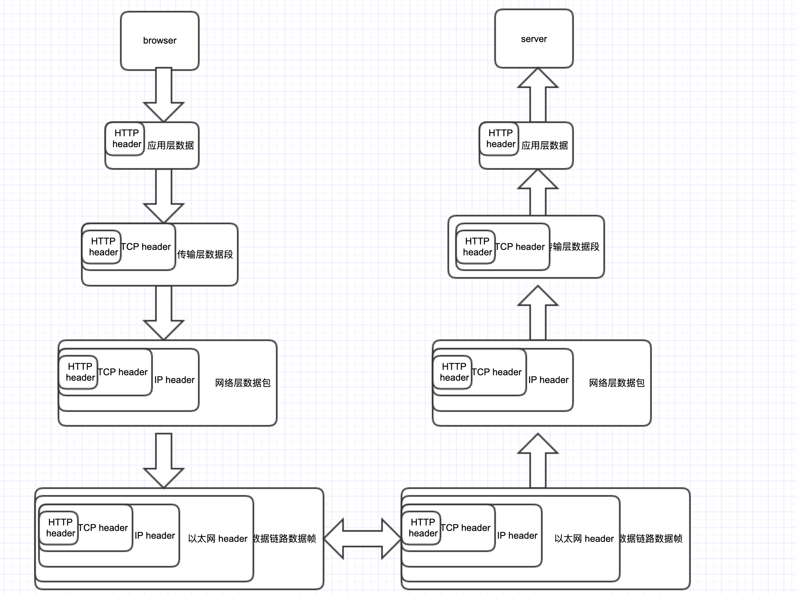

###1. TCP/IP 通信传输流

​		利用 TCP/IP 协议族进行网络通信时，会通过分层顺序与对方进行通信。发送端从应用层往下走，接收端则从链路层往上走。

* 首先作为发送端的客户端在应用层（HTTP 协议）发出一个想看某个 Web 页面的 HTTP 请求。
* 接着，为了传输方便，在传输层（TCP 协议）把从应用层处收到的数据（HTTP 请求报文）进行分割，并在各个报文上打上标记序号及端口号后转发给网络层。
* 在网络层（IP 协议），增加作为通信目的地的 MAC 地址后转发给链路层。这样一来，发往网络的通信请求就准备齐全了。
* 接收端的服务器在链路层接收到数据，按序往上层发送，一直到应用层。当传输到应用层，才能算真正接收到由客户端发送过来的 HTTP请求。

### 2. HTTP 概述

* **超文本传输协议**（英语：**H**yper**T**ext **T**ransfer **P**rotocol，缩写：**HTTP**）是一种用于分布式、协作式和[超媒体](https://zh.wikipedia.org/wiki/超媒體)信息系统的应用层协议。HTTP是[万维网](https://zh.wikipedia.org/wiki/全球資訊網)的数据通信的基础。
* HTTP属于OSI模型中的应用层协议，通常建立在TCP协议之上。
* HTTP消息是服务器和客户端之间交换数据的方式。有两种类型的消息︰ 请求（requests）--由客户端发送用来触发一个服务器上的动作；响应（responses）--来自服务器的应答。

###3. HTTP工作流程

HTTP通信机制是在一次完整的 HTTP 通信过程中，客户端与服务器之间将完成下列7个步骤：

1. **建立 TCP 连接**
   在HTTP工作开始之前，客户端首先要通过网络与服务器建立连接，该连接是通过 TCP 来完成的，该协议与 IP 协议共同构建 Internet，即著名的 TCP/IP 协议族，因此 Internet 又被称作是 TCP/IP 网络。HTTP 是比 TCP 更高层次的应用层协议，根据规则，只有低层协议建立之后，才能进行高层协议的连接，因此，首先要建立 TCP 连接，一般 TCP 连接的端口号是80；
2. **客户端向服务器发送请求命令**
   一旦建立了TCP连接，客户端就会向服务器发送请求命令；
   例如：`GET/sample/hello.jsp HTTP/1.1`
3. **客户端发送请求头信息**
   客户端发送其请求命令之后，还要以头信息的形式向服务器发送一些别的信息，之后客户端发送了一空白行来通知服务器，它已经结束了该头信息的发送；
4. **服务器应答**
   客户端向服务器发出请求后，服务器会客户端返回响应；
   例如： `HTTP/1.1 200 OK`
   响应的第一部分是协议的版本号和响应状态码
5. **服务器返回响应头信息**
   正如客户端会随同请求发送关于自身的信息一样，服务器也会随同响应向用户发送关于它自己的数据及被请求的文档；
6. **服务器向客户端发送数据**
   服务器向客户端发送头信息后，它会发送一个空白行来表示头信息的发送到此为结束，接着，它就以 Content-Type 响应头信息所描述的格式发送用户所请求的实际数据；
7. **服务器关闭 TCP 连接**
   一般情况下，一旦服务器向客户端返回了请求数据，它就要关闭 TCP 连接，然后如果客户端或者服务器在其头信息加入了这行代码 `Connection:keep-alive`，TCP 连接在发送后将仍然保持打开状态，于是，客户端可以继续通过相同的连接发送请求。保持连接节省了为每个请求建立新连接所需的时间，还节约了网络带宽。

###4. HTTP 协议基础

* ####通过请求和响应的交换达成通信

  应用 HTTP 协议时，必定是一端担任客户端角色，另一端担任服务器端角色。仅从一条通信线路来说，服务器端和客服端的角色是确定的。HTTP 协议规定，请求从客户端发出，最后服务器端响应该请求并返回。**换句话说，肯定是先从客户端开始建立通信的，服务器端在没有接收到请求之前不会发送响应。

* ####HTTP 是不保存状态的协议

  HTTP 是一种无状态协议。协议自身不对请求和响应之间的通信状态进行保存。也就是说在 HTTP 这个级别，协议对于发送过的请求或响应都不做持久化处理。这是为了更快地处理大量事务，确保协议的可伸缩性，而特意把 HTTP 协议设计成如此简单的。
  可是随着 Web 的不断发展，我们的很多业务都需要对通信状态进行保存。于是我们引入了 Cookie 技术。有了 Cookie 再用 HTTP 协议通信，就可以管理状态了。

* ####使用 Cookie 的状态管理

  Cookie 技术通过在请求和响应报文中写入 Cookie 信息来控制客户端的状态。Cookie 会根据从服务器端发送的响应报文内的一个叫做 Set-Cookie 的首部字段信息，通知客户端保存Cookie。当下次客户端再往该服务器发送请求时，客户端会自动在请求报文中加入 Cookie 值后发送出去。服务器端发现客户端发送过来的 Cookie 后，会去检查究竟是从哪一个客户端发来的连接请求，然后对比服务器上的记录，最后得到之前的状态信息。

* #### 请求 URI 定位资源

  HTTP 协议使用 URI 定位互联网上的资源。正是因为 URI 的特定功能，在互联网上任意位置的资源都能访问到。

* #### 持久连接

  HTTP 协议的初始版本中，每进行一个 HTTP 通信都要断开一次 TCP 连接。比如使用浏览器浏览一个包含多张图片的 HTML 页面时，在发送请求访问 HTML 页面资源的同时，也会请求该 HTML 页面里包含的其他资源。因此，每次的请求都会造成无畏的 TCP 连接建立和断开，增加通信量的开销。
  为了解决上述 TCP 连接的问题，HTTP/1.1 和部分 HTTP/1.0 想出了持久连接的方法。**其特点是，只要任意一端没有明确提出断开连接，则保持 TCP 连接状态。旨在建立一次 TCP 连接后进行多次请求和响应的交互。**在 HTTP/1.1 中，所有的连接默认都是持久连接。

* ####管线化

  持久连接使得多数请求以管线化方式发送成为可能。以前发送请求后需等待并接收到响应，才能发送下一个请求。管线化技术出现后，不用等待亦可发送下一个请求。这样就能做到同时并行发送多个请求，而不需要一个接一个地等待响应了。
  比如，当请求一个包含多张图片的 HTML 页面时，与挨个连接相比，用持久连接可以让请求更快结束。而管线化技术要比持久连接速度更快。请求数越多，时间差就越明显。

  

###5. HTTP 协议报文结构

用于 HTTP 协议交互的信息被称为 HTTP 报文。请求端（客户端）的 HTTP 报文叫做请求报文；响应端（服务器端）的叫做响应报文。HTTP 报文本身是由多行（用 CR+LF 作换行符）数据构成的字符串文本。

#### 5.1 请求报文结构

请求报文以下数据组成：

- **请求行** —— 包含用于请求的方法、请求 URI 和 HTTP 版本。
- **首部字段** —— 包含表示请求的各种条件和属性的各类首部。（通用首部、请求首部、实体首部以及RFC里未定义的首部如 Cookie 等）
- **请求实体**

####5.2 响应报文结构

响应报文由以下数据组成：

- **状态行** —— 包含表明响应结果的状态码、原因短语和 HTTP 版本。
- **首部字段** —— 包含表示请求的各种条件和属性的各类首部。（通用首部、响应首部、实体首部以及RFC里未定义的首部如 Cookie 等）
- **请求实体**

#### 5.3 HTTP 报文首部之首部字段

* 通用首部

  * Cache-Control 控制缓存的行为 
  * Connection 逐挑首部、连接的管理 
  * Date 创建报文的日期时间 
  * Pragma 报文指令 
  * Trailer 报文末端的首部一览 
  * Transfer-Encoding 指定报文主体的传输编码方式 
  * Upgrade 升级为其他协议 
  * Via 代理服务器的相关信息 
  * Warning 错误通知

* 请求首部

  * Accept 用户代理可处理的媒体类型 
  * Accept-Charset 优先的字符集 
  * Accept-Encoding 优先的内容编码
  * Accept-Language 优先的语言（自然语言） 
  * Authorization Web认证信息 
  * Expect 期待服务器的特定行为 
  * From 用户的电子邮箱地址 
  * Host 请求资源所在服务器 
  * If-Match 比较实体标记（ETag）
  *  If-Modified-Since 比较资源的更新时间 
  * If-None-Match 比较实体标记（与 If-Macth 相反）
  * If-Range 资源未更新时发送实体 Byte 的范围请求 
  * If-Unmodified-Since 比较资源的更新时间(与 If-Modified-Since 相反) 
  * Max-Forwards 最大传输逐跳数 
  * Proxy-Authorization 代理服务器要求客户端的认证信息 Range 实体的字节范围请求 
  * Referer 对请求中 URI 的原始获取方 
  * TE 传输编码的优先级 
  * User-Agent HTTP 客户端程序的信息

* 响应首部

  * Accept-Ranges 是否接受字节范围请求
  *  Age 推算资源创建经过时间 
  * ETag 资源的匹配信息 
  * Location 令客户端重定向至指定 URI 
  * Proxy-Authenticate 代理服务器对客户端的认证信息 
  * Retry-After 对再次发起请求的时机要求
  *  Server HTTP 服务器的安装信息 
  * Vary 代理服务器缓存的管理信息 
  * WWW-Authenticate 服务器对客户端的认证信息

* 实体首部

  * Allow 资源可支持的 HTTP 方法 
  * Content-Encoding 实体主体适用的编码方式 
  * Content-Language 实体主体的自然语言 Content-Length 实体主体的大小（单位：字节） 
  * Content-Location 替代对应资源的 URI 
  * Content-MD5 实体主体的报文摘要 
  * Content-Range 实体主体的位置范围 
  * Content-Type 实体主体的媒体类型 
  * Expires 实体主体过期的日期时间 
  * Last-Modified 资源的最后修改日期时间

* 为 Cookie 服务的首部字段

  | 首部字段名 |               说明               |   首部类型   |
  | :--------: | :------------------------------: | :----------: |
  | Set-Cookie | 开始状态管理所使用的 Cookie 信息 | 响应首部字段 |
  |   Cookie   |    服务器接收到的 Cookie 信息    | 请求首部字段 |

  * Set-Cookie取值

    * NAME=VALUE 赋予 Cookie 的名称和其值（必需项） 
    * expires=DATE Cookie 的有效期（若不明确指定则默认为浏览器关闭前为止） 
    * path=PATH 将服务器上的文件目录作为Cookie的适用对象（若不指定则默认为文档所在的文件目录）
    * domain=域名 作为 Cookie 适用对象的域名 （若不指定则默认为创建 Cookie的服务器的域名） 、
    * Secure 仅在 HTTPS 安全通信时才会发送 Cookie 
    * HttpOnly 加以限制，使 Cookie 不能被 JavaScript 脚本访问

  * ##### Cookie

    `Cookie: status=enable`
    首部字段 Cookie 会告知服务器，当客户端想获得 HTTP 状态管理支持时，就会在请求中包含从服务器接收到的 Cookie。接收到多个 Cookie 时，同样可以以多个 Cookie 形式发送。

###6. HTTP 响应状态码

* 1xx Informational(信息性状态码) 接收的请求正在处理 

  * 101 转换协议 http切换到websocket

* 2xx Success(成功状态码) 请求正常处理完毕 

  * 200 ok 请求已成功，请求所希望的响应头或数据体将随此响应返回。
  * 204 No Content  服务器成功处理了请求，没有返回任何内容。
  * 206 Partial Content. 服务器已经成功处理了部分GET请求。视频，文件分片下载

* 3xx Redirection(重定向状态码) 需要进行附加操作以完成请求 

  * 301  Moved Permanently 被请求的资源已永久移动到新位置
  * 304 Not Modified 表示资源在由请求头中的If-Modified-Since或If-None-Match参数指定的这一版本之后，未曾被修改。

* 4xx Client Error(客户端错误状态码) 服务器无法处理请求 

  * 400 Bad Request  由于明显的客户端错误（例如，格式错误的请求语法，太大的大小，无效的请求消息或欺骗性路由请求），服务器不能或不会处理该请求。
  * 401 Unauthorized 未认证
  * 403 Forbidden 服务器已经理解请求，但是拒绝执行它
  * 404 Not Found 请求失败，请求所希望得到的资源未被在服务器上发现，但允许用户的后续请求。
  * 405 Method Not Allowed  请求行中指定的请求方法不能被用于请求相应的资源。
  * 408 Request Timeout 请求超时

* 5xx Server Error(服务器错误状态码) 服务器处理请求出错

  * 500 Internal Server Error  通用错误消息，服务器遇到了一个未曾预料的状况，导致了它无法完成对请求的处理。没有给出具体错误信息

  - 501 Not Implemented  服务器不支持当前请求所需要的某个功能。当服务器无法识别请求的方法，并且无法支持其对任何资源的请求（例如，网络服务API的新功能）

  - 502 Bad Gateway 作为网关或者代理工作的服务器尝试执行请求时，从上游服务器接收到无效的响应。

  - 503 Service Unavailable  由于临时的服务器维护或者过载，服务器当前无法处理请求。这个状况是暂时的，并且将在一段时间以后恢复。如果能够预计延迟时间，那么响应中可以包含一个Retry-After头用以标明这个延迟时间。如果没有给出这个Retry-After信息，那么客户端应当以处理500的方式处理它。

  - 504 Gateway Timeout  作为网关或者代理工作的服务器尝试执行请求时，未能及时从上游服务器或者辅助服务器（例如DNS）收到响应。

    注意：某些代理服务器在DNS查询超时时会返回400或者500错误。

  - 505 HTTP Version Not Supported  服务器不支持，或者拒绝支持在请求中使用的HTTP版本。

### 7. HTTP 请求方式

* GET: 通常用于请求服务器发送某些资源

* HEAD: 请求资源的头部信息, 并且这些头部与 HTTP GET 方法请求时返回的一致. 该请求方法的一个使用场景是在下载一个大文件前先获取其大小再决定是否要下载, 以此可以节约带宽资源

* OPTIONS: 用于获取目的资源所支持的通信选项

* POST: 发送数据给服务器

* PUT: 用于新增资源或者使用请求中的有效负载替换目标资源的表现形式

* DELETE: 用于删除指定的资源

* PATCH: 用于对资源进行部分修改

* CONNECT: HTTP/1.1协议中预留给能够将连接改为管道方式的代理服务器

* TRACE: 回显服务器收到的请求，主要用于测试或诊断

**PUT与GET请求方式区别**

* 数据传输方式不同：GET请求通过URL传输数据，而POST的数据通过请求体传输。

* 安全性不同：POST的数据因为在请求主体内，所以有一定的安全性保证，而GET的数据在URL中，通过历史记录，缓存很容易查到数据信息。

* 数据类型不同：GET只允许 ASCII 字符，而POST无限制

* GET无害： 刷新、后退等浏览器操作GET请求是无害的，POST可能重复提交表单

* 特性不同：GET是安全（这里的安全是指只读特性，就是使用这个方法不会引起服务器状态变化）且幂等（幂等的概念是指同一个请求方法执行多次和仅执行一次的效果完全相同），而POST是非安全非幂等