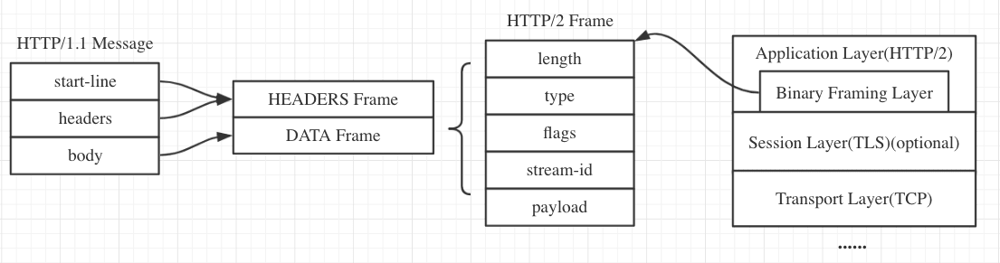

## [HTTP2](https://juejin.im/post/5b88a4f56fb9a01a0b31a67e#heading-39)

### 1. HTTP1.x存在主要问题

* **TCP 连接数限制**

  对于同一个域名，浏览器最多只能同时创建 6~8 个 TCP 连接 (不同浏览器不一样)。为了解决数量限制，出现了 `域名分片`技术，其实就是资源分域，将资源放在不同域名下 (比如二级子域名下)，这样就可以针对不同域名创建连接并请求，以一种讨巧的方式突破限制，但是滥用此技术也会造成很多问题，比如每个 TCP 连接本身需要经过 DNS 查询、三步握手、慢启动等，还占用额外的 CPU 和内存，对于服务器来说过多连接也容易造成网络拥挤、交通阻塞等，对于移动端来说问题更明显。

* **线头阻塞 (Head Of Line Blocking) 问题**

  每个 TCP 连接同时只能处理一个请求 - 响应，浏览器按 FIFO 原则处理请求，如果上一个响应没返回，后续请求 - 响应都会受阻。为了解决此问题，出现了 [管线化 - pipelining](https://link.juejin.im/?target=https%3A%2F%2Fzh.wikipedia.org%2Fwiki%2FHTTP%E7%AE%A1%E7%B7%9A%E5%8C%96)技术，但是管线化存在诸多问题，比如第一个响应慢还是会阻塞后续响应、服务器为了按序返回相应需要缓存多个响应占用更多资源、浏览器中途断连重试服务器可能得重新处理多个请求、还有必须客户端 - 代理 - 服务器都支持管线化。管线化无法做到完全的并行。

* 头部数据问题

  Header 内容多，而且每次请求 Header 不会变化太多，没有相应的压缩传输优化方案

* 明文传输不安全

### 2. HTTP2 改进

* 二进制分帧传输

  帧是数据传输的最小单位，以二进制传输代替原本的明文传输，原本的报文消息被划分为更小的数据帧:



```
strict-transport-security: max-age=63072000; includeSubdomains 字段是服务器开启 HSTS 策略，让浏览器强制使用 HTTPS 进行通信，可以减少重定向造成的额外请求和会话劫持的风险
```

* 多路复用

  在一个 TCP 连接上，我们可以向对方不断发送帧，每帧的 stream identifier 的标明这一帧属于哪个流，然后在对方接收时，根据 stream identifier 拼接每个流的所有帧组成一整块数据。 把 HTTP/1.1 每个请求都当作一个流，那么多个请求变成多个流，请求响应数据分成多个帧，不同流中的帧交错地发送给对方，这就是 HTTP/2 中的多路复用。

  流的概念实现了单连接上多请求 - 响应并行，解决了线头阻塞的问题，减少了 TCP 连接数量和 TCP 连接慢启动造成的问题

  所以 http2 对于同一域名只需要创建一个连接，而不是像 http/1.1 那样创建 6~8 个连接:

* 服务端推送 (Server Push)

  浏览器发送一个请求，服务器主动向浏览器推送与这个请求相关的资源，这样浏览器就不用发起后续请求。

  Server-Push 主要是针对资源内联做出的优化，相较于 http/1.1 资源内联的优势:

  - 客户端可以缓存推送的资源
  - 客户端可以拒收推送过来的资源
  - 推送资源可以由不同页面共享
  - 服务器可以按照优先级推送资源

* Header 压缩 (HPACK)

  使用 HPACK 算法来压缩首部内容