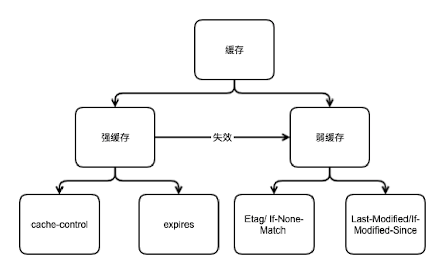

## HTTP缓存策略

### 1. HTTP 强缓存

在已有浏览器缓存数据并且根据过期时间判断缓存数据未过期的情况下直接使用缓存。

### 2. HTTP弱缓存

在已有浏览器缓存数据的情况下，浏览器会根据已有缓存数据的标识去向服务器核实是否有数据更新。如果没有数据更新则使用缓存，否则使用从服务器获得的新资源。在强缓存失效的情况下会使用弱缓存。

### 3. 相关字段

1. **Expires**（强缓存）

   Expires的值为服务端返回的到期时间，即下一次请求时，请求时间小于服务端返回的到期时间，直接使用缓存数据。不过Expires 是HTTP 1.0的东西，现在默认浏览器均默认使用HTTP 1.1，所以它的作用基本忽略。

   另一个问题是，到期时间是由服务端生成的，但是客户端时间可能跟服务端时间有误差，这就会导致缓存命中的误差。所以HTTP 1.1 的版本，使用Cache-Control替代。

2. **Cache-Control**（强缓存）

   Cache-Control 是最重要的规则。常见的取值有private、public、no-cache、max-age，no-store，默认为private。优先级高于Expires。

   ```javascript
   private:             客户端可以缓存
   public:              客户端和代理服务器都可缓存（前端的同学，可以认为public和private是一样的）
   max-age=xxx:   缓存的内容将在 xxx 秒后失效
   no-cache:          需要使用对比缓存来验证缓存数据（后面介绍）
   no-store:           所有内容都不会缓存，强制缓存，对比缓存都不会触发
   ```

3. **Etag/ If-None-Match**（弱缓存）

   服务器端返回字段 Etag： xxxx (一般为md5值) 对应客户端匹 配字段为If-None-Match: w/xxx(xxx的值和上面的etag的xxx一样则返回304，否则返回修改后的资源)。优先级高于If-Modified-Since

4. **Last-Modified/If-Modified-Since**（弱缓存）

   服务器端返回字段：Last-Modifieddate(日期),对应客户端匹配字段If-Modified-Since:date（如果服务器date小于等于客户端请求date则返回304，否则返回修改后的资源））。




### 4. 最优HTTP缓存

#### 1. Html 文档

html文档一般文件名称不变，为了能够及时更新，可以设置为cache-control:no-cache 或者设置cache-control的max-age值为一个较小时间。

####2.. JS/CSS/Image等资源

由于现代前端工程化流程比较完善，通过项目构建工具打包出来的前端代码文件都附有hash值，所有可以开启强缓存，设置cache-control的max-age值为一个比较长的时间值。如86400（一天）