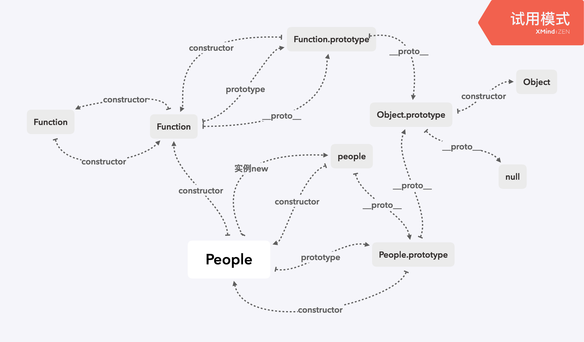
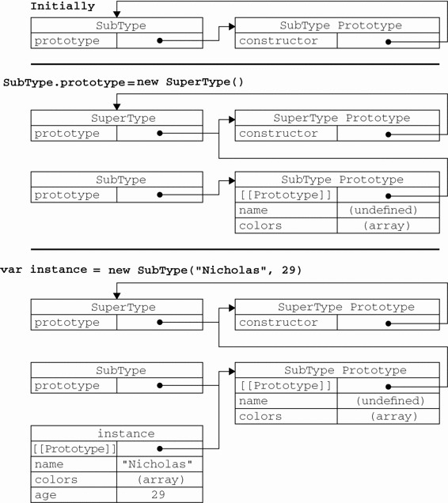

1. 

2. 继承的概念

   * 对象之间的继承，类/构造函数之间的继承
   * 自身拥有的私有属性/继承而来的公有属性 的继承

   

3. 继承基本原理

    

   

4. 寄生组合模式

   ```shell
   // People 构造函数
   function People(name, age) {
     this.name = name;
     this.age = age;
     if (typeof People.prototype.say !== 'function') {
       Object.assign(People.prototype, {
         say() {
           console.log('object', 'hello');
         },
       });
     }
   }
   const people = new People('tian baolin', 18);
   
   // Man构造函数
   function Man(name, age) {
     People.call(this, name, age);
     this.sex = 'male';
     if (typeof Man.prototype.say2 !== 'function') {
       Object.assign(Man.prototype, {
         say2() {
           console.log('object', 'world');
         },
       });
     }
     
     if (Man.prototype instanceof People === false) {
       Object.setPrototypeOf(Man.prototype, People.prototype);
     }
     
   }
   const man = new Man('tbl', 24);
   
   ```

   ```javascript
   function Person() {
     this.name = 'person';
   }
   Person.prototype.say = function name() {
     console.log('say :', 'say');
   };
   function Man() {
     Person.call(this);
     this.name = 'man';
   }
   Man.prototype.say = function name() {
     console.log('man :', 'man');
   };
   
   // Object.setPrototypeOf(Man.prototype, Person.prototype);
   
   Man.prototype = Object.create(Person.prototype);
   Man.prototype.constructor = Man;
   
   const man = new Man();
   console.log('man :', man);
   ```

   

   

   

   

